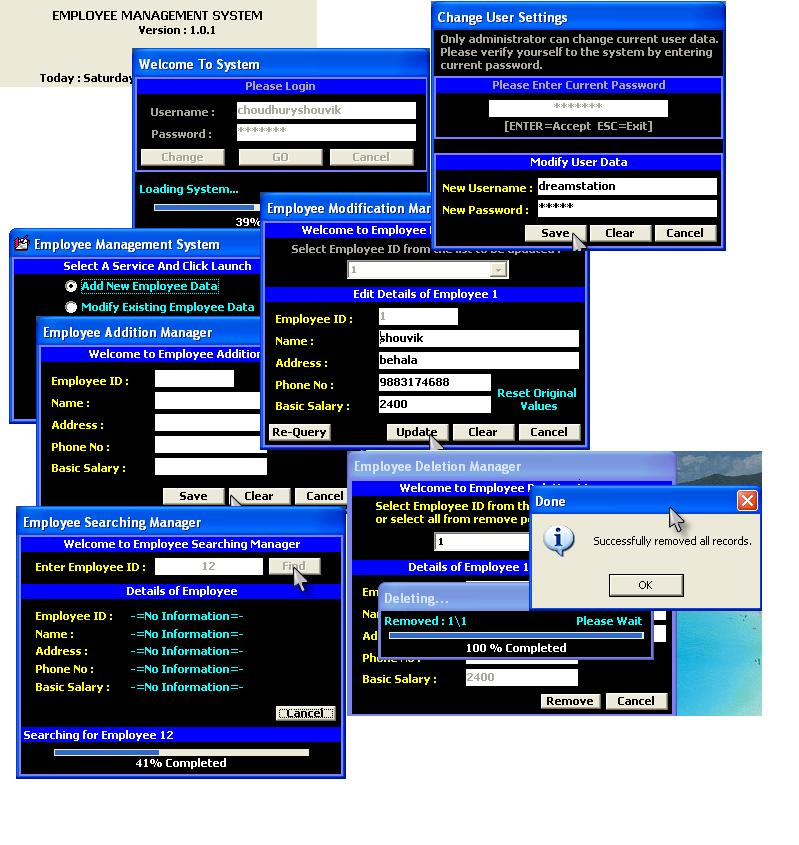



## Employee Management System

### Description

This is a yet completed employee management system.I developed this application as a project for my course semester. It has the functionalities like addition,modification,deletion,searching,etc. with nice gui(see screenshot). This code will teach you some basic and advanced strong field validations.I think this code is not too much complicated to understand.If you find any bugs please notify it by posting your comment.Any suggestions for improving this application will be appreciated.If you like this application then please vote for it.It will encourage me to post some more advanced applications on PSC in future.
 
### More Info
 

             |
---                |---
**Submitted On**   |2007-05-10 18:51:16
**By**             |[Shouvik\_The RealTime Coder](https://github.com/Planet-Source-Code/PSCIndex/blob/master/ByAuthor/shouvik-the-realtime-coder.md)
**Level**          |Advanced
**User Rating**    |3.8 (15 globes from 4 users)
**Compatibility**  |VB 5\.0, VB 6\.0
**Category**       |[Complete Applications](https://github.com/Planet-Source-Code/PSCIndex/blob/master/ByCategory/complete-applications__1-27.md)
**World**          |[Visual Basic](https://github.com/Planet-Source-Code/PSCIndex/blob/master/ByWorld/visual-basic.md)
**Archive File**   |[Employee\_M2065065112007\.zip](https://github.com/Planet-Source-Code/shouvik-the-realtime-coder-employee-management-system__1-68562/archive/master.zip)

